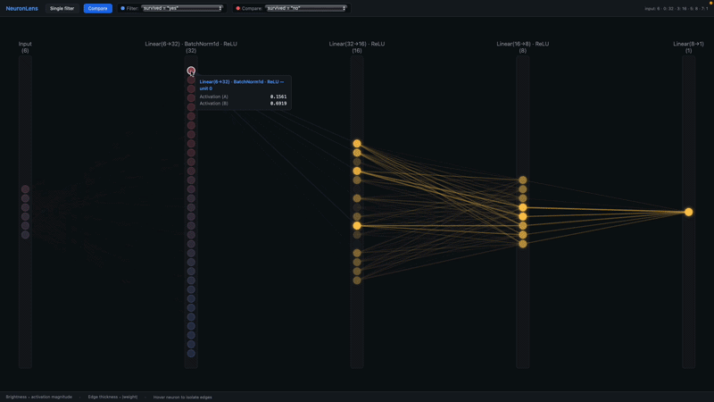

# NeuronLens

Interactive neural network activation visualizer. Give it a trained model and a labeled dataset — it generates a fully self-contained HTML file where you can explore how activations flow through the network, filter by metadata, and trace individual neuron influences forward through the layers.



## Features

- **Activation visualization** — neuron brightness reflects mean absolute activation under the active filter
- **Metadata filtering** — precompute statistics for arbitrary dataset subsets (`label == "cat"`, `age > 30`, etc.)
- **Two-filter comparison** — overlay two groups with blue/red hue blending per neuron, brightness from combined activation
- **Hover propagation** — hover any neuron to trace its signal forward: downstream neurons and edges are recolored by how much of that neuron's activation they receive
- **Neuron reordering** — neurons are automatically permuted within each layer to minimize weighted edge crossings, grouping neurons that "fire together"; optionally sort by class preference instead
- **Large layer support** — layers exceeding `max_display_units` are bucketed for display
- **Fully static output** — a single `index.html` with all data inlined; open directly in any browser, no server needed

> **Note:** Conv2d layer support is still a draft. The spatial grid rendering works, but hover propagation between conv layers is not yet meaningful and the visualization is not useful for CNN inspection at this stage.

## Installation

```bash
pip install torch numpy pandas
```

Clone and import directly (no package install needed):

```python
import sys
sys.path.insert(0, "/path/to/NeuronLens")
from neuronlens import NeuronLens
```

## Example — Titanic survival

Train a small MLP on the Titanic dataset and visualize how survival correlates with neuron activations across layers.

```python
import torch.nn as nn
import pandas as pd
from neuronlens import NeuronLens
from neuronlens.filters import eq, and_

model = nn.Sequential(
    nn.Linear(6, 32), nn.BatchNorm1d(32), nn.ReLU(),
    nn.Linear(32, 16), nn.ReLU(),
    nn.Linear(16, 8),  nn.ReLU(),
    nn.Linear(8, 1),
)

# metadata has columns: survived ("yes"/"no"), sex, pclass, adult
viz = NeuronLens(
    model=model,
    dataset=X,               # (887, 6) float32 array
    metadata=metadata,       # pd.DataFrame with one row per sample
    reorder_by="survived",   # sort neurons by survival correlation
    precomputed_filters=[
        eq("survived", "yes"),
        eq("survived", "no"),
        eq("sex", "female"),
        eq("sex", "male"),
        eq("pclass", "1"),
        eq("pclass", "3"),
        and_(eq("survived", "yes"), eq("sex", "female")),
        and_(eq("survived", "no"),  eq("sex", "male")),
    ],
)

viz.show("./titanic_output")
# → opens titanic_output/index.html in your browser
```

Run the full self-contained example:

```bash
pip install scikit-learn
python examples/titanic_example.py
```

## Usage

```python
import torch.nn as nn
import pandas as pd
from neuronlens import NeuronLens

model = nn.Sequential(
    nn.Linear(10, 32), nn.ReLU(),
    nn.Linear(32, 16), nn.ReLU(),
    nn.Linear(16, 2),
)

viz = NeuronLens(
    model=model,
    dataset=X,           # array-like, shape (n_samples, n_features)
    metadata=metadata,   # pd.DataFrame, shape (n_samples, n_meta_cols)
    precomputed_filters=[
        {"column": "label", "op": "eq", "value": "cat"},
        {"column": "label", "op": "eq", "value": "dog"},
        {"column": "age",   "op": "gt", "value": 30},
    ],
)

viz.generate("./output")
# → open output/index.html in any browser
```

### Filter spec

Each filter is a dict with `column`, `op`, and `value`. Supported ops:

| op | meaning |
|----|---------|
| `eq` | == |
| `ne` | != |
| `lt` / `le` | < / ≤ |
| `gt` / `ge` | > / ≥ |
| `in` / `not_in` | membership |

Combine multiple conditions with `{"and": [cond1, cond2, ...]}`.

### Constructor options

| Parameter | Default | Description |
|-----------|---------|-------------|
| `max_display_units` | `200` | Neurons per layer above this are bucketed |
| `n_reorder_passes` | `10` | Sweep iterations for the crossing-score minimizer |
| `precomputed_filters` | `[]` | Filter groups to precompute activations for |
| `reorder_by` | `None` | Metadata column to sort neurons by class preference instead of crossing-score |
| `record_pre_activation` | `False` | Also store post-linear (pre-norm/activation) activations |

## Interface

| Control | Description |
|---------|-------------|
| **Filter dropdown** | Switch between precomputed dataset subsets |
| **Compare mode** | Show two filters simultaneously with blue/red hue |
| **Hover a neuron** | Propagate its activation forward through all downstream layers |

## How it works

1. **Adapter** — wraps the model with forward hooks to capture per-layer activations and weight matrices
2. **Reordering** — either minimizes weighted crossing score via iterative adjacent-swap, or sorts by per-class center-of-mass score when `reorder_by` is set
3. **Precomputation** — for each filter group, computes per-neuron mean absolute activation; stored in `data/activations.json`
4. **Export** — `data/network.json` holds layer sizes, reordered permutations, and weight matrices; both are inlined into `index.html` at generation time
5. **Rendering** — pure canvas-based JS renderer; no framework or server required

## File structure

```
neuronlens/
├── core.py          # NeuronLens main class
├── reorder.py       # Crossing-score minimisation and class-based reordering
├── activations.py   # Filter parsing and activation aggregation
├── export.py        # JSON builders and file writer
├── render/
│   ├── template.html
│   ├── main.js      # Canvas renderer
│   └── style.css
└── adapters/
    ├── base.py      # Abstract ModelAdapter
    └── pytorch.py   # PyTorch nn.Linear / Conv2d adapter
examples/
├── titanic_example.py   # Titanic MLP — tabular classification
└── cifar10_example.py   # CIFAR-10 CNN (conv rendering draft)
test_run.py              # End-to-end test on synthetic data
```
